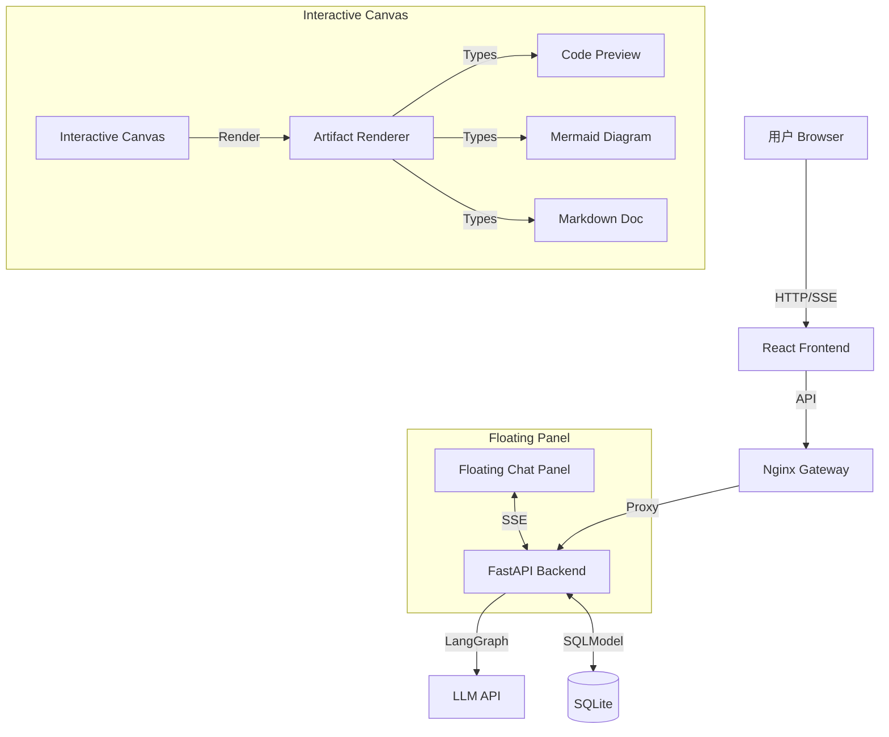

# XPouch AI

基于 LangGraph 的高颜值多智能体 AI 助手，支持**双层交互画布**与**实时内容渲染**。

## 🚀 功能特性

### 🎨 双层交互画布 (核心亮点)

**底层 - 可交互画布 (Interactive Canvas)**
- 全屏覆盖 (`h-screen w-screen`)，固定定位不遮挡
- 径向渐变 + 网格背景，支持深色模式
- **缩放功能**：滚轮缩放 (25%-300%)，底部控制栏
- **平移功能**：拖拽移动，鼠标手势流畅
- **Artifact 渲染**：根据类型动态展示代码预览、流程图、Markdown 文档

**顶层 - 悬浮对话面板 (Floating Chat Overlay)**
- 毛玻璃效果 (`bg-white/90 backdrop-blur-xl`)
- 圆角设计 (`rounded-2xl`)，高深度阴影 (`shadow-2xl`)
- **可收起/展开**：右上角收起按钮 + 右下角机器人恢复按钮
- **平滑动画**：300ms ease-in-out 过渡，紫色渐变机器人图标
- **呼吸效果**：机器人恢复按钮带 `animate-bounce` 提示交互
- **点击穿透**：收起后 `pointer-events-none` 确保画布可点击

### 🤖 AI 智能体
- **8 个专业化 AI 智能体**：内置不同场景的专家助手
- **自定义智能体创建**：用户可构建个性化 AI 助手
- **LangGraph 工作流**：Python 版智能体引擎

### 💬 对话体验
- **实时打字效果**：自然的消息生成与打字动画
- **SSE 流式响应**：基于 Token 的实时流式传输
- **上下文记忆**：自动保存和恢复多轮对话上下文

### 🧭 产品路线图

**当前阶段：核心功能完善 (v0.2.x)**
- ✅ 双层交互画布系统
- ✅ 基础 AI 智能体工作流
- ✅ 数据持久化与历史管理
- ✅ 完整的 UI/UX 体系

**下一阶段：超智能体探索 (v0.3.x)**
- 🔮 **多智能体协作**：智能体之间的动态任务分工与协作机制
- 🔮 **自主决策系统**：基于上下文的智能任务拆解与执行规划
- 🔮 **知识增强引擎**：知识库检索与实时学习能力
- 🔮 **推理与反思**：自我纠错、多步推理、思维链机制
- 🔮 **工具调用框架**：可插拔的工具生态系统（搜索、计算、代码执行等）

### 🎯 界面特性
- **响应式设计**：完美适配移动端、平板和桌面设备
- **移动端手势**：左侧边缘右滑返回（30px 触发区域）
- **深色模式支持**：根据系统偏好自动切换主题，平滑过渡动画
- **国际化**：支持英语、中文和日语
- **路由管理**：React Router 深度集成，支持 URL 分享会话
- **Glassmorphism 设计**：毛玻璃效果 + 深度阴影 + 流畅动画

### 💾 数据持久化
- **SQLite 云端同步**：聊天记录持久化存储
- **历史记录管理**：按时间排序，支持查看和删除

### ⚡ 性能优化
- **Zustand 全局状态管理**：组件逻辑与视图分离
- **智能缓存与按需加载**
- **按需渲染**：交互区域动态加载

## 🛠️ 技术栈

### 前端
| 技术 | 用途 |
|------|------|
| React 18.3.1 + TypeScript 5.6 | UI 框架 |
| React Router 7 | 路由管理 |
| Zustand | 全局状态管理 |
| Vite 5.4.17 | 构建工具 |
| Tailwind CSS 3.4.17 | 样式 |
| shadcn/ui + Radix UI | 组件库 |
| Framer Motion 11.15.0 | 动画与交互 |
| Lucide React | 图标 |
| Mermaid 11.4.0 | 流程图渲染 |
| Vitest | 测试 |

### 后端
| 技术 | 用途 |
|------|------|
| Python 3.10+ | 后端语言 |
| FastAPI + Uvicorn | Web 框架 |
| LangGraph + LangChain | AI 工作流 |
| SQLModel + SQLite | ORM + 数据库 |
| uv | 包管理 |

## 🏗️ 系统架构



## 📦 项目结构

**Monorepo 架构** - 前后端分离：

```
xpouch-ai/
├── frontend/                      # 🌐 React 前端应用
│   ├── src/
│   │   ├── components/            # 组件
│   │   │   ├── CanvasChatPage.tsx    # 画布聊天主页
│   │   │   ├── InteractiveCanvas.tsx # 可交互画布 ⭐NEW
│   │   │   ├── FloatingChatPanel.tsx # 悬浮对话面板 ⭐NEW
│   │   │   ├── ArtifactRenderer.tsx  # 内容渲染器 ⭐NEW
│   │   │   ├── TaskCanvas.tsx        # 任务画布
│   │   │   ├── Sidebar.tsx           # 侧边栏
│   │   │   ├── GlowingInput.tsx      # 发光输入框
│   │   │   └── ...
│   │   ├── store/                 # Zustand 状态管理
│   │   │   ├── chatStore.ts          # 对话历史
│   │   │   └── canvasStore.ts        # 画布状态
│   │   ├── hooks/                 # 自定义 Hooks
│   │   │   ├── useChat.ts             # 聊天逻辑
│   │   │   └── useArtifactListener.ts # SSE 监听 ⭐NEW
│   │   ├── services/              # API 客户端
│   │   ├── config/                # 配置
│   │   └── i18n/                  # 国际化
│   ├── vite.config.ts             # Vite 配置
│   └── nginx.conf                 # Nginx 配置 (Docker)
│
├── backend/                       # 🔧 Python 后端
│   ├── agents/                    # LangGraph 智能体
│   │   └── graph.py               # 工作流定义
│   ├── main.py                    # FastAPI 入口 & 业务逻辑
│   ├── models.py                  # SQLModel 数据模型
│   ├── database.py                # 数据库连接
│   ├── pyproject.toml             # Python 依赖
│   └── data/                      # 数据持久化目录
│
├── docker-compose.yml             # 🐳 Docker 编排
└── README.md                      # 📚 本文档
```

## 🚀 快速开始

### 前置条件

- Node.js >= 16.0.0
- Python >= 3.10
- `uv` (推荐的 Python 包管理器)

### 安装

**1. 安装前端依赖**

```bash
cd frontend
pnpm install
```

**2. 安装后端依赖**

```bash
cd backend
uv sync
```

### 配置

**后端配置** - 复制 `backend/.env.example` 到 `backend/.env`：

```env
PORT=3002

# 模型提供商 API Keys（至少选择一个）
OPENAI_API_KEY=your-api-key
OPENAI_BASE_URL=https://api.openai.com/v1

DEEPSEEK_API_KEY=your-deepseek-key
DEEPSEEK_BASE_URL=https://api.deepseek.com/v1
```

**前端配置** - 复制 `frontend/.env.example` 到 `frontend/.env`：

```env
VITE_API_URL=/api
```

### 运行应用

**1. 启动后端**

```bash
cd backend
uv run main.py
```
后端将在 http://localhost:3002 运行。

**2. 启动前端**

```bash
cd frontend
pnpm run dev
```
前端将在 http://localhost:5173 运行。

## 🐳 Docker 部署（推荐）

本项目已完全容器化，支持一键部署。

### 1. 准备环境

确保服务器已安装 [Docker](https://docs.docker.com/get-docker/) 和 [Docker Compose](https://docs.docker.com/compose/install/)。

### 2. 配置环境变量

在 `backend` 目录下创建 `.env` 文件：

```bash
# 必需：设置 API Key
OPENAI_API_KEY=sk-your-key-here
OPENAI_BASE_URL=https://api.openai.com/v1

# 可选：如果使用 DeepSeek
DEEPSEEK_API_KEY=sk-your-deepseek-key
DEEPSEEK_BASE_URL=https://api.deepseek.com/v1
```

### 3. 启动服务

```bash
docker-compose up --build -d
```

### 4. 访问应用

服务启动后，访问 `http://localhost:8080`：

- 前端：`http://localhost:8080`
- 后端 API：`http://localhost:8080/api`

### 5. 数据持久化

所有数据（数据库文件）会自动保存在 `./data` 文件夹中。

### 6. 更新部署

```bash
git pull
docker-compose up --build -d
```

## 📖 使用指南

### 双层交互画布

1. **缩放**：使用鼠标滚轮或底部控制栏（25%-300%）
2. **平移**：按住画布空白区域拖动
3. **收起面板**：点击右上角收起图标
4. **恢复面板**：点击右下角紫色机器人按钮
5. **移动端返回**：从屏幕左侧边缘右滑返回首页（滑动 >100px 触发）

### Artifact 渲染

- **代码**：自动识别并渲染代码预览
- **Mermaid**：动态渲染流程图、时序图等
- **Markdown**：安全渲染 Markdown 文档

## 🤝 贡献

1. Fork 本仓库
2. 创建特性分支 (`git checkout -b feature/AmazingFeature`)
3. 提交更改 (`git commit -m 'Add some AmazingFeature'`)
4. 推送到分支 (`git push origin feature/AmazingFeature`)
5. 打开 Pull Request

## 📄 许可证

本项目基于 MIT 许可证开源。
