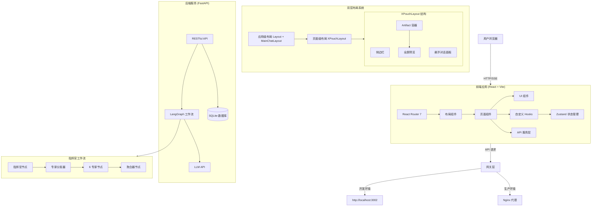

# XPouch AI

基于 LangGraph 的高颜值多智能体 AI 助手，支持**指挥官工作流**与**双层交互画布**。

## 🚀 功能特性

### 🧠 指挥官工作流 (核心引擎)

**指挥官节点 (commander_node)**
- 分析用户查询，智能拆解为多个子任务
- 生成执行策略和预估步骤数
- JSON 解析兼容 DeepSeek 等多种 LLM

**专家分发器 (expert_dispatcher_node)**
- 循环分发任务到对应专家节点
- 支持 6 种专业专家：search/coder/researcher/analyzer/writer/planner
- 统一的结果格式和错误处理

**聚合器节点 (aggregator_node)**
- 整合所有专家执行结果
- 生成结构化 Markdown 响应
- 包含执行统计和后续建议

### 🎨 双层交互画布 (核心亮点)

**架构层级**：应用级布局 + 页面级布局

**应用级布局 (Layout.tsx + MainChatLayout.tsx)** - 所有页面共享
- **侧边栏**：固定 92px 宽度，z-index: 150，全局优先级
- **主内容区域**：通过 React Router Outlet 渲染子页面
- **移动端适配**：汉堡菜单 + 遮罩层 + 响应式侧边栏

**页面级布局 (XPouchLayout.tsx)** - 聊天页面专用
- **左侧 - Artifact 容器**：
  - 代码/HTML/Markdown/搜索结果渲染
  - 支持全屏预览（z-index: 99999）
  - 深色面板，圆角设计（PC端）
- **右侧 - 悬浮对话面板**：
  - 毛玻璃效果 (`bg-white/95 backdrop-blur-md`)
  - **Flexbox 滚动架构**：消息区域独立滚动，Header/Input 固定
  - **PC 端**：400px 宽度，圆角设计，可收起/展开
  - **移动端**：全屏显示，手势滑动切换对话/产物
  - **智能体状态显示**：顶部浮动状态条显示当前执行专家

**全屏预览模式**：
- 点击放大按钮进入全屏预览
- 隐藏对话面板，最大化 Artifact 显示区域
- 背景遮罩 + 居中展示，支持点击关闭

### 🤖 AI 智能体系统
- **8 个内置智能体**：不同场景的专业助手
- **自定义智能体创建**：用户可构建个性化 AI 助手
- **LangGraph Python 工作流**：模块化智能体引擎
- **任务会话管理**：SubTask + TaskSession 数据模型

### 💬 对话体验
- **实时打字效果**：自然的消息生成与打字动画
- **SSE 流式响应**：基于 Token 的实时流式传输
- **上下文记忆**：自动保存和恢复多轮对话
- **专家状态指示**：实时显示当前执行中的专家

### 📱 移动端体验
- **全屏对话模式**：固定高度，消息区域滚动
- **手势切换**：点击切换对话/产物视图
- **滑动返回**：左侧边缘右滑返回（滑动手势 >100px 触发）
- **无返回按钮**：移除物理按钮，依赖手势交互

### 🧭 开发路线图

### 📌 v0.3.x - 超智能体系统（当前）

- ✅ 指挥官工作流：任务拆解 → 专家分发 → 结果聚合
- ✅ 6 专业专家池：search/coder/researcher/analyzer/writer/planner
- ✅ SubTask + TaskSession 数据模型
- ✅ JSON 解析器：兼容所有 LLM 提供商
- ✅ 响应式布局：移动端/平板/桌面完美适配
- ✅ Flexbox 滚动架构：Header/Input 固定，消息独立滚动
- 🚧 知识库集成（RAG）
- 🚧 用户认证与权限管理

### 🎯 v1.0 - 产品化（未来）

- 🔮 **插件市场**：社区驱动的智能体和工具生态
- 🔮 **企业级功能**：团队协作、审计日志、API 管理
- 🔮 **多模态支持**：图像、语音、视频输入
- 🔮 **云端部署**：SaaS 服务 + 私有化部署支持

### 🎯 技术特性
- **响应式设计**：完美适配移动端、平板和桌面设备
- **深色模式支持**：根据系统偏好自动切换主题
- **国际化**：支持英语、中文和日语
- **路由管理**：React Router 7，支持 URL 分享会话
- **Glassmorphism**：毛玻璃效果 + 深度阴影 + 流畅动画
- **粒子网格**：动态背景效果，处理消息时触发汇聚动画

### 💾 数据持久化
- **SQLite 数据库**：SQLModel ORM 框架
- **任务会话**：TaskSession + SubTask 完整链路
- **历史记录**：按时间排序，支持查看和删除

### ⚡ 性能优化
- **Zustand 全局状态管理**：组件逻辑与视图分离
- **按需渲染**：交互区域动态加载
- **智能缓存**：减少重复请求

## 🛠️ 技术栈

### 前端

| 技术 | 版本 | 用途 |
|------|------|------|
| React | 18.3.1 | UI 框架 |
| TypeScript | 5.6 | 类型系统 |
| React Router | 7.12.0 | 路由管理 |
| Zustand | 5.0.10 | 全局状态管理 |
| Vite | 5.4.17 | 构建工具 |
| Tailwind CSS | 3.4.17 | 原子化样式 |
| shadcn/ui + Radix UI | Latest | 无头组件库 |
| Framer Motion | 11.15.0 | 动画与交互 |
| Lucide React | 0.462.0 | 图标库 |
| Mermaid | 11.12.2 | 流程图渲染 |
| DOMPurify | 3.3.1 | HTML 安全净化 |
| Vitest | 4.0.17 | 单元测试 |

### 后端

| 技术 | 版本 | 用途 |
|------|------|------|
| Python | 3.13+ | 后端语言 |
| FastAPI | 0.128.0+ | 异步 Web 框架 |
| Uvicorn | 0.40.0+ | ASGI 服务器 |
| LangGraph | 1.0.6+ | AI 工作流编排 |
| LangChain OpenAI | 1.1.7+ | LLM 集成 |
| SQLModel | 0.0.31+ | ORM 框架 |
| SQLite | 3.x | 数据库 |
| uv | Latest | Python 包管理器 |

## 🏗️ 系统架构



## 📦 项目结构

**Monorepo 架构** - 前后端分离：

```
xpouch-ai/
├── frontend/                      # 🌐 React 前端应用
│   ├── src/
│   │   ├── components/            # React 组件
│   │   │   ├── Layout.tsx             # 应用级布局容器
│   │   │   ├── MainChatLayout.tsx     # 统一侧边栏布局（所有页面）
│   │   │   ├── XPouchLayout.tsx       # 双层交互画布布局（聊天页专用）
│   │   │   ├── CanvasChatPage.tsx      # 画布聊天页
│   │   │   ├── InteractiveCanvas.tsx   # 可交互画布
│   │   │   ├── FloatingChatPanel.tsx    # 悬浮对话面板
│   │   │   ├── ArtifactRenderer.tsx     # 内容渲染器
│   │   │   ├── Sidebar.tsx              # 侧边栏主组件
│   │   │   ├── SidebarMenu.tsx          # 侧边栏菜单
│   │   │   ├── SidebarUserSection.tsx   # 用户区域
│   │   │   ├── SidebarSettingsMenu.tsx   # 设置菜单
│   │   │   ├── GlowingInput.tsx         # 发光输入框
│   │   │   ├── AgentCard.tsx            # 智能体卡片
│   │   │   ├── CreateAgentPage.tsx      # 创建智能体页
│   │   │   ├── HomePage.tsx             # 首页
│   │   │   ├── HistoryPage.tsx          # 历史记录页
│   │   │   ├── KnowledgeBasePage.tsx     # 知识库页
│   │   │   ├── ErrorBoundary.tsx        # 错误边界
│   │   │   ├── artifacts/               # Artifact 子组件
│   │   │   │   ├── CodeArtifact.tsx
│   │   │   │   ├── DocArtifact.tsx
│   │   │   │   ├── HtmlArtifact.tsx
│   │   │   │   ├── SearchArtifact.tsx
│   │   │   │   └── TextArtifact.tsx
│   │   │   └── ui/                      # shadcn/ui 基础组件
│   │   ├── store/                 # Zustand 状态管理
│   │   │   ├── chatStore.ts           # 对话历史
│   │   │   ├── canvasStore.ts         # 画布状态
│   │   │   ├── userStore.ts           # 用户信息
│   │   │   └── loadingStore.ts        # 全局加载状态
│   │   ├── hooks/                 # 自定义 Hooks
│   │   │   ├── useChat.ts              # 聊天逻辑
│   │   │   ├── useSwipeBack.ts         # 滑动返回
│   │   │   └── useArtifactListener.ts  # SSE 监听
│   │   ├── services/              # API 服务层
│   │   │   └── api.ts                  # API 客户端
│   │   ├── config/                # 配置文件
│   │   │   └── models.ts              # 模型配置
│   │   ├── constants/             # 常量定义
│   │   │   └── ui.ts                  # UI 常量
│   │   ├── types/                 # TypeScript 类型
│   │   │   └── index.ts               # 全局类型定义
│   │   ├── utils/                 # 工具函数
│   │   │   ├── logger.ts              # 日志工具
│   │   │   └── userSettings.ts        # 用户设置
│   │   ├── i18n/                  # 国际化
│   │   ├── data/                  # 静态数据
│   │   ├── lib/                   # 第三方库封装
│   │   ├── main.tsx               # 应用入口
│   │   └── vite.config.ts         # Vite 配置
│   ├── nginx.conf                 # Nginx 配置 (Docker)
│   ├── package.json               # NPM 依赖
│   └── tsconfig.json              # TypeScript 配置
│
├── backend/                       # 🔧 Python 后端
│   ├── agents/                    # LangGraph 智能体
│   │   ├── graph.py               # 指挥官工作流定义
│   │   ├── commander.py           # 指挥官节点
│   │   └── experts.py             # 专家池实现
│   ├── utils/                     # 工具模块
│   │   └── json_parser.py         # JSON 解析器
│   ├── main.py                    # FastAPI 应用入口
│   ├── models.py                  # SQLModel 数据模型
│   ├── database.py                # 数据库连接
│   ├── config.py                  # 配置管理
│   ├── pyproject.toml             # Python 项目配置
│   ├── .env                       # 环境变量 (需手动创建)
│   ├── Dockerfile                 # Docker 镜像配置
│   └── data/                      # SQLite 数据库目录
│
├── docker-compose.yml             # 🐳 Docker 编排配置
├── CHANGELOG.md                   # 📝 更新日志
└── README.md                      # 📚 项目文档
```

## 🚀 快速开始

### 方式一：Docker 部署（推荐）

**1. 克隆项目**

```bash
git clone https://github.com/your-username/xpouch-ai.git
cd xpouch-ai
```

**2. 配置环境变量**

在 `backend` 目录下创建 `.env` 文件：

```bash
# API 配置
PORT=3002

# 模型提供商 API Keys（至少选择一个）
OPENAI_API_KEY=sk-your-key-here
OPENAI_BASE_URL=https://api.openai.com/v1

# 可选：DeepSeek（更便宜的替代方案）
DEEPSEEK_API_KEY=sk-your-deepseek-key
DEEPSEEK_BASE_URL=https://api.deepseek.com/v1
```

**3. 启动服务**

```bash
docker-compose up --build -d
```

**4. 访问应用**

- 前端：http://localhost:8080
- 后端 API：http://localhost:8080/api

**5. 停止服务**

```bash
docker-compose down
```

### 方式二：本地开发

**前置要求**

- Node.js >= 18.0.0
- Python >= 3.10 (推荐 3.13)
- `uv` (推荐的 Python 包管理器)

**1. 安装前端依赖**

```bash
cd frontend
pnpm install
```

**2. 安装后端依赖**

```bash
cd backend
uv sync
```

**3. 配置环境变量**

后端配置（创建 `backend/.env`）：

```env
PORT=3002
OPENAI_API_KEY=your-api-key
OPENAI_BASE_URL=https://api.openai.com/v1
```

前端配置（创建 `frontend/.env`）：

```env
VITE_API_URL=http://localhost:3002/api
```

**4. 启动后端**

```bash
cd backend
uv run main.py
```

**5. 启动前端**

```bash
cd frontend
pnpm run dev
```

**6. 访问应用**

- 前端：http://localhost:5173
- 后端 API：http://localhost:3002

## 🔧 配置说明

### 后端配置（`backend/.env`）

| 变量 | 说明 | 必需 | 默认值 |
|------|------|------|--------|
| `PORT` | 后端服务端口 | 否 | `3002` |
| `OPENAI_API_KEY` | OpenAI API 密钥 | 是* | - |
| `OPENAI_BASE_URL` | OpenAI API 基础 URL | 否 | `https://api.openai.com/v1` |
| `DEEPSEEK_API_KEY` | DeepSeek API 密钥 | 是* | - |
| `DEEPSEEK_BASE_URL` | DeepSeek API 基础 URL | 否 | `https://api.deepseek.com/v1` |

> \* 至少需要配置一个 LLM 提供商的 API 密钥

### 前端配置（`frontend/.env`）

| 变量 | 说明 | 必需 | 默认值 |
|------|------|------|--------|
| `VITE_API_URL` | 后端 API 地址 | 否 | `/api` |

> **开发环境**：使用 `http://localhost:3002/api`
> **生产环境**：使用 `/api`（由 Nginx 代理）

## 📖 使用指南

### 指挥官工作流

1. **发送查询**：在对话框中输入您的需求
2. **任务拆解**：指挥官节点分析查询，拆分为多个子任务
3. **专家执行**：任务分发给对应的专家节点并行处理
4. **结果聚合**：聚合器整合所有专家结果，生成最终响应

### 双层交互画布

**架构说明**：
- **应用级布局**：`Layout.tsx` + `MainChatLayout.tsx` 提供统一的侧边栏和主内容区域
- **页面级布局**：`XPouchLayout.tsx` 在聊天页面实现双层交互画布效果

**使用方法**：
1. **切换视图**：移动端点击顶部切换对话/产物视图
2. **全屏预览**：点击放大按钮查看完整 Artifact 内容（隐藏对话面板）
3. **收起面板**：PC端点击收起按钮，释放画布空间
4. **移动端返回**：从屏幕左侧边缘右滑返回首页

### Artifact 渲染

- **代码**：自动识别并渲染代码预览，支持复制
- **HTML**：iframe 实时预览
- **Markdown**：安全渲染 Markdown 文档
- **搜索结果**：结构化展示搜索结果

### 创建自定义智能体

1. 点击首页的"创建智能体"按钮
2. 填写智能体名称、描述、分类
3. 编写系统提示词（定义 AI 的行为和性格）
4. 实时预览卡片效果
5. 点击"创建"完成

### 多模型支持

项目支持多个 LLM 提供商：

- **OpenAI**：GPT-4o, GPT-4o-mini, GPT-3.5-turbo
- **DeepSeek**：deepseek-chat, deepseek-coder
- **Anthropic**：Claude 3.5 Sonnet（需配置）
- **Google**：Gemini Pro（需配置）

在 `backend/.env` 中配置相应的 API 密钥即可。

## 🤝 贡献指南

我们欢迎所有形式的贡献！

### 开发规范

- **代码风格**：遵循 ESLint 和 Prettier 配置
- **提交信息**：使用 Conventional Commits 规范
- **测试**：为新增功能编写单元测试
- **文档**：更新相关文档和 CHANGELOG

### 提交 Pull Request

1. Fork 本仓库
2. 创建特性分支：`git checkout -b feature/amazing-feature`
3. 提交更改：`git commit -m 'feat: add amazing feature'`
4. 推送到分支：`git push origin feature/amazing-feature`
5. 打开 Pull Request 并描述更改内容

### 报告问题

- [Bug 反馈](https://github.com/your-username/xpouch-ai/issues/new?template=bug_report.md)
- [功能建议](https://github.com/your-username/xpouch-ai/issues/new?template=feature_request.md)

## 📚 技术文档

- [CHANGELOG.md](./CHANGELOG.md) - 详细的更新日志
- [API 文档](http://localhost:3002/docs) - FastAPI Swagger 文档（启动后端后访问）

## 📄 许可证

本项目基于 [MIT License](./LICENSE) 开源。

## 🙏 致谢

感谢以下开源项目：

- [LangGraph](https://github.com/langchain-ai/langgraph) - AI 工作流框架
- [shadcn/ui](https://ui.shadcn.com/) - 美观的 UI 组件库
- [Framer Motion](https://www.framer.com/motion/) - React 动画库
- [Tailwind CSS](https://tailwindcss.com/) - 原子化 CSS 框架
- [Radix UI](https://www.radix-ui.com/) - 无头 UI 组件

## 📮 联系方式

- **作者**：Your Name
- **邮箱**：your-email@example.com
- **主页**：https://yourwebsite.com

## 🌟 Star History

如果这个项目对你有帮助，请给我们一个 Star！

<a href="https://star-history.com/#your-username/xpouch-ai&Date">
  <picture>
    <source media="(prefers-color-scheme: dark)" srcset="https://api.star-history.com/svg?repos=your-username/xpouch-ai&type=Date&theme=dark" />
    <source media="(prefers-color-scheme: light)" srcset="https://api.star-history.com/svg?repos=your-username/xpouch-ai&type=Date&theme=light" />
    
  </picture>
</a>
