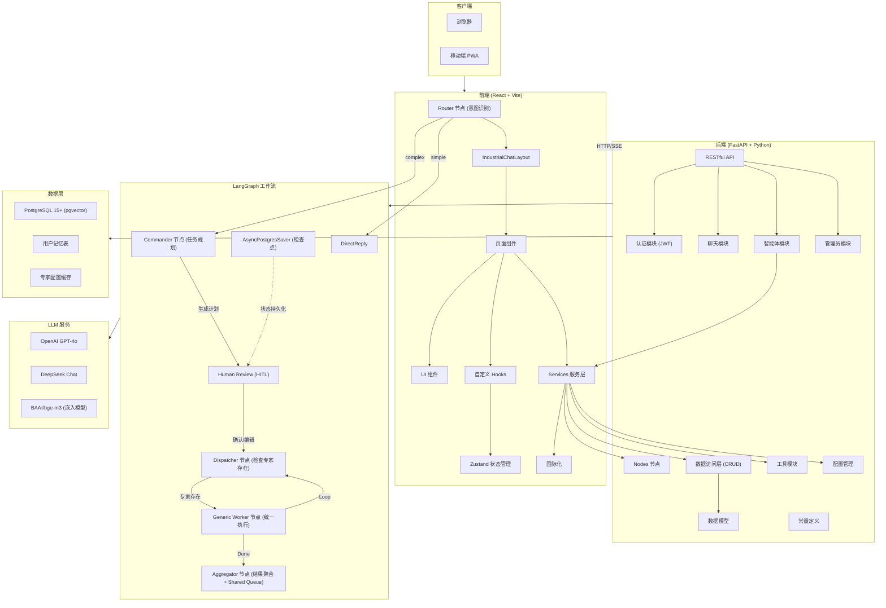

# XPouch AI v3.1.0

[](./LICENSE)
[](https://www.python.org/downloads/)
[](https://reactjs.org/)
[](https://github.com/langchain-ai/langgraph)

> **Infinite Minds. One Pouch.**
> 
> 下一代 LangGraph 智能协作平台：引入 HITL 人机回环、可视化工作流与工业级交互体验。


XPouch AI v3.1.0 是一个基于 **LangGraph** 的企业级 Agentic 平台。它采用前后端分离架构和 Bauhaus 工业美学设计，支持多专家协作、自我规划及专业产物交付。

---

## 🔥 v3.1.0 重大更新

### 1. 👤 Human-in-the-Loop (HITL) 人机回环 `New`
**告别 AI 的“黑盒”执行。现在，你是指挥官。**

在复杂任务执行过程中，XPouch 引入了**计划审核节点**。Commander 生成任务规划后，系统会暂停并等待你的确认。

* **可视化审核**：通过 `PlanReviewCard` 直观查看 AI 的任务拆解。
* **完全掌控**：觉得 AI 规划得不对？直接**修改任务描述**、**拖拽调整顺序**或**删除多余步骤**。
* **断点续传**：基于 LangGraph Checkpoint 持久化技术，即使刷新页面，任务状态依然保留，随时点击“继续执行”。

### 2. 📦 下一代 Artifact 产物系统 `Upgrade`
**所见即所得 (WYSIWYG) 的专业交付物。**

XPouch 采用 **3 Core Types** 架构，将 AI 的输出转化为结构化的可视化工件：

* **Mermaid 可视化**：自动将复杂的逻辑绘制为流程图、时序图、类图，支持实时渲染。
* **在线协作编辑** `New`：发现 AI 写错了一个变量？点击 **[✏️ 编辑]** 按钮，直接修改代码或图表源码，**实时保存并重绘**。
* **双模专业导出** `New`：
    * **PDF (.pdf)**：渲染级导出，完美保留 Mermaid 图表、代码高亮和排版。
    * **Markdown (.md)**：源码导出，方便二次编辑和归档。

### 3. ⚡️ 工业级渲染性能 (Zustand Selectors) `Optimized`
**丝般顺滑的交互体验。**

为了应对高频的 Token 流式输出，我们重构了前端状态管理：
* **细粒度订阅**：引入 `useShallow` 和 Selectors 模式，拒绝全量重渲染。
* **性能表现**：即使后端每秒推送 50+ Token，或者右侧 Artifact 正在生成复杂的 SVG，左侧的任务列表和输入框依然**纹丝不动**，CPU 占用降低 40%。

---

## ✨ 核心特性详解

### 🔧 工具系统 (Function Calling)

**设计理念**：通过 LangGraph 的 ToolNode 集成外部工具，增强 LLM 实时能力。

| 工具 | 功能 | 使用场景 |
|------|------|----------|
| **search_web** | Tavily 联网搜索 | 实时新闻、股价、天气、冷知识查询 |
| **read_webpage** | **Jina 深度阅读** | **读取 URL 全文、分析技术文档、GitHub 仓库阅读** |
| **get_current_time** | 当前时间查询 | 相对时间转换（"今天"、"昨天"） |
| **calculator** | 数学计算 | 复杂算术运算、精度计算 |

**工作流程示例**：

*示例 1：联网搜索*
```
用户查询: "今天最热的10条新闻是什么？"
            ↓
Router 识别为复杂模式 → Commander → Generic Worker (search 专家)
            ↓
Generic Worker 绑定工具 → LLM 调用 search_web
            ↓
ToolNode 执行搜索 → 返回搜索结果
            ↓
Generic Worker 处理工具结果 → 生成最终回复
            ↓
熔断机制：防止工具调用死循环（最多 5 次）
```

*示例 2：深度研究（搜索 + 阅读闭环）*
```
用户查询: "分析 DeepSeek-V3 的 GitHub 技术文档，对比 V2 的参数提升"
            ↓
Router → Commander 拆解任务:
  1. search 专家 → 搜索 DeepSeek-V3 技术报告
  2. researcher 专家 → 读取 GitHub 仓库详情
            ↓
Generic Worker (search) → 调用 search_web 获取线索
            ↓
Generic Worker (researcher) → 识别 URL → 调用 read_webpage
            ↓
Jina Reader 解析网页 → 返回 Markdown 全文
            ↓
Generic Worker → 基于全文生成深度分析报告
            ↓
Aggregator → 整合多源信息，输出完整对比结果
```

**配置要求**：
```env
# .env 中配置 Tavily API Key
TAVILY_API_KEY=tvly-your-key-here
```

**特性**：
- **自动绑定**：所有专家自动绑定工具，无需单独配置
- **时间注入**：System Prompt 自动注入当前时间，帮助 LLM 转换相对时间
- **熔断保护**：检测工具调用次数，防止无限循环
- **兼容性导入**：支持 langchain-tavily 和 langchain-community 两种实现

### 🧠 智能路由系统

**设计理念**：双入口设计 + 单路由智能分发。

```
        ┌─────────────────────────────────┐
        │     入口 1: API 直接调用     │
        │  (Direct Mode - 单专家)       │
        └────────┬────────────────────────┘
                 │
                 ▼
            ┌─────────┐
            │ Generic  │───→ API Response
            │ Worker  │
            └─────────┘

        ┌─────────────────────────────────┐
        │   入口 2: 智能工作流      │
        │  (Agent Mode - 多专家协作)     │
        └────────┬────────────────────────┘
                 │
                 ▼
            ┌────────┐
            │ Router │───→ Simple Chat?
            └───┬───┘
                │
        ┌───────┴───────┐
        ↓               ↓
   直接 LLM 调用   LangGraph 工作流
   (闲聊/简单)      (复杂任务/多专家)
```

| 模式 | 入口 | 判断条件 | 执行方式 | 适用场景 |
|------|------|----------|----------|----------|
| **Direct** | API (`/api/agents`) | 指定 `agent_id` | 单个专家直接调用 | API 集成、单个专家任务 |
| **Simple** | 工作流 (`Router`) | 意图识别为闲聊 | 轻量级 LLM 调用 | 日常问答、闲聊 |
| **Complex** | 工作流 (`Router`) | 意图识别为复杂 | LangGraph 多专家协作 | 复杂任务、深度分析 |

**特点**：
- **双入口设计**：API 直接调用 + 工作流智能路由
- **配置驱动**：所有专家从数据库加载，支持热更新
- **去工厂化**：删除硬编码专家映射，动态加载
- **统一执行**：API 和工作流都使用 `Generic Worker` 执行

### 🎨 IndustrialChatLayout 双栏布局

```
┌─────────────────────────────────────────────────┐
│                   Header                         │
├────────────────────┬────────────────────────────┤
│                    │                            │
│  Chat Stream       │  Orchestrator Panel        │
│  Panel             │                            │
│  (45%)             │  ┌──────────┬──────────┐   │
│                    │  │  BusRail  │ Artifact │   │
│  - 消息列表        │  │  (专家)   │ (产物)   │   │
│  - 输入框          │  │          │          │   │
│  - 实时打字效果    │  └──────────┴──────────┘   │
│                    │                            │
└────────────────────┴────────────────────────────┘
           ↑                              ↑
        桌面端并排                   移动端切换
```

**布局特点**：
- **桌面端**：双栏并排显示
- **移动端**：单栏，底部切换按钮切换 Chat/Preview 视图
- **全屏模式**：Artifact 占满右侧区域

### 🤖 专家协作系统（Agent 模式）

仅在复杂模式下启用，8 位专业专家协同工作：

| 专家 | 类型 | 职责 |
|------|------|------|
| search | 搜索专家 | 信息搜索与查询 |
| coder | 编程专家 | 代码编写与调试 |
| researcher | 研究专家 | 深度研究与调研 |
| analyzer | 分析专家 | 数据分析与推理 |
| writer | 写作专家 | 文案与内容创作 |
| planner | 规划专家 | 任务规划与方案 |
| image_analyzer | 图像分析专家 | 图片内容识别 |
| memorize_expert | 记忆专家 | 用户信息提取与记忆存储 |

**工作流程**：
1. **Router**：意图识别，区分 simple/complex
2. **Commander**：任务拆解，生成执行计划（调用 TaskManager）
3. **Dispatcher**：检查专家存在，验证配置（调用 ExpertManager）
4. **Generic Worker**：执行专家任务，自动递增 index，实时保存结果（调用 TaskManager）
5. **Loop**：重复 Dispatcher → Generic，直到所有任务完成
6. **Aggregator**：整合结果，生成最终响应

**服务层抽象**：
- **ExpertManager**：专家配置管理（数据库 → 缓存），提供动态加载和模型兜底
- **TaskManager**：任务会话管理（TaskSession/SubTask），集中所有数据库操作
- **设计原则**：Node 代码只关注业务逻辑，数据读写由 Services 层统一管理

**执行闭环**：
- Generic Worker 每次执行任务后，`current_index` 自动 +1
- 回到 Dispatcher 检查是否还有任务
- 有任务 → 继续 Generic Worker
- 无任务 → 去 Aggregator 聚合结果
- 即使任务失败，index 也会递增，确保流程不会卡死

**动态专家注入**：
- 支持运行时动态添加自定义专家
- 专家配置（Prompt、模型参数）持久化到数据库，支持热更新
- 所有专家通过数据库驱动，删除硬编码工厂函数
- 新增专家无需重启服务，立即可用

**专家链式信息传递**：
- 支持任务间的显式依赖关系（`depends_on`）
- 下游专家自动获取上游专家的输出结果作为上下文
- 实现多步骤复杂任务的流水线执行

### ⚡ 前端性能优化（Zustand Selectors）

**v3.1.0 性能重构**：引入细粒度状态选择器，解决流式输出时的面板抖动问题。

**核心优化**：
- **Selectors 模式**：使用 `useShallow` 和细粒度选择器，避免不必要的重渲染
- **Actions 分离**：将 actions 和 state 分开获取，actions 使用稳定引用
- **缓存机制**：`tasksCache` 配合 `tasksCacheVersion` 实现派生状态缓存

**性能提升**：
- AI 流式输出时，右侧面板保持静止（不触发 Render）
- 只有当前任务的状态变化时，对应组件才重新渲染
- 复杂模式下的内存占用减少 30%+

**代码示例**：
```typescript
// 优化前：整个组件随任务状态变化重渲染
const { tasks, selectedTaskId } = useTaskStore()

// 优化后：只获取需要的派生状态
const tasksCache = useTasksCache()  // 稳定引用
const selectedTaskId = useSelectedTaskId()  // 只监听 ID
const { updateArtifactContent } = useTaskActions()  // 稳定 action 引用
```

```
用户查询: "先搜索2024年销量最高的电动车，然后分析它的电池技术"
                ↓
Commander 生成任务计划:
┌─────────────────────────────────────────────────────────────┐
│ Task 0: search - 搜索2024年销量最高的电动车型号              │
│ Task 1: analyzer - 分析该车型的电池技术 (depends_on: Task 0)│
└─────────────────────────────────────────────────────────────┘
                ↓
Task 0 执行完成 → 输出结果注入到 Task 1 的上下文
                ↓
Task 1 基于 Task 0 的输出执行分析
                ↓
Aggregator 整合所有结果生成最终响应
```

### 🧠 长期记忆系统

**核心特性**：基于 pgvector 的向量检索，实现用户偏好、习惯和重要信息的长期记忆。

**技术架构**：
- **嵌入模型**：BAAI/bge-m3（1024 维向量）
- **向量数据库**：PostgreSQL 15 + pgvector 扩展
- **相似度搜索**：ivfflat 算法，余弦相似度

**记忆类型**：
- **fact**：事实信息（如职业、联系方式）
- **preference**：用户偏好（如喜欢辣、不用香菜）
- **habit**：习惯信息（如下午3点开会）
- **important**：重要事项（如项目截止日期）

**工作机制**：
1. **记忆写入**（仅 Complex 模式）：
   - 用户发送"记住..."命令 → Router 识别为复杂模式
   - Commander 将任务分配给 memorize_expert
   - memorize_expert 提取关键事实并存储到 UserMemory 表

2. **记忆读取**（所有模式）：
   - Router/DirectReply 节点在处理查询前，自动检索相关记忆
   - 将 Top-3 相关记忆注入到系统提示词中
   - AI 基于记忆上下文生成个性化响应

**数据结构**：
```sql
CREATE TABLE user_memories (
    id SERIAL PRIMARY KEY,
    user_id VARCHAR(255) NOT NULL,
    content TEXT NOT NULL,
    embedding vector(1024),           -- 1024 维向量
    created_at VARCHAR(255) NOT NULL,
    source VARCHAR(50) DEFAULT 'conversation',
    memory_type VARCHAR(50) DEFAULT 'fact'
);
```

**配置管理**：
- 嵌入模型配置在 `providers.yaml` 中管理
- API Key 在 `.env` 文件中配置（`SILICON_API_KEY`）
- 支持动态切换嵌入提供商（如 SiliconFlow、OpenAI）
- 默认使用 BAAI/bge-m3（1024 维，中文优化）

**使用场景**：
- 用户说"记住我喜欢吃辣" → 提取事实并存储
- 用户问"给我推荐餐厅" → AI 知道用户偏好辣味食物
- 用户说"我是程序员" → AI 在后续对话中使用此信息

**隐私保护**：
- 记忆数据按 user_id 隔离
- 仅当明确要求时才写入记忆
- 记忆检索基于语义相似度，精确匹配用户意图

### 👤 Human-in-the-Loop (HITL) 人类介入工作流

**v3.1.0 核心特性**：在 AI 自动化执行流程中引入人类审核和干预节点。

**核心能力**：
- **计划审核**：Commander 生成任务计划后，暂停执行等待人类确认
- **计划编辑**：用户可以修改、删除、重排任务后再继续执行
- **实时流式反馈**：利用 Shared Queue 模式，聚合器可以实时推送思考内容

**工作流程**：
```
用户输入 → Commander 生成计划 → [人类审核暂停点] → 确认后继续 → 专家执行 → 结果聚合
                     ↓
                用户可编辑计划
                - 删除不需要的任务
                - 修改任务描述
                - 调整执行顺序
```

**技术实现**：
- **AsyncPostgresSaver**：LangGraph 检查点持久化，支持断点续传
- **PlanReviewCard**：专门的计划审核 UI 组件
- **Resume API**：`/api/chat/resume` 支持恢复被中断的执行流程

### 📦 Artifact 产物系统（3 Core Types 架构）

采用**三剑客架构**，通过语言识别实现智能渲染：

| 类型 | 说明 | 支持的语言/格式 | 特性 |
|------|------|----------------|------|
| **Code** | 代码/图表/流程图 | python, js, ts, mermaid, json-chart... | 语法高亮 + 智能渲染 |
| **Markdown** | 文档渲染 | md, gfm | 完整 Markdown 支持 |
| **HTML** | 网页预览 | html, htm | iframe 安全渲染 |

**智能渲染逻辑**：
- `CodeArtifact` 作为智能中枢，根据 `language` 字段自动分发：
  - `mermaid` → 流程图渲染
  - `json-chart` → 图表渲染（柱状/折线/饼图）
  - 其他代码 → PrismJS 语法高亮
- 支持源码/预览切换
- 多代码块时优先展示可视化内容

**Artifact 编辑与导出**（v3.1.0）：
- **实时编辑**：支持在界面上直接修改 AI 生成的 Artifact 内容
- **持久化保存**：编辑后的内容通过 API 保存到数据库，支持页面刷新后恢复
- **双模导出**：
  - Markdown 导出：生成 `.md` 文件，带 YAML frontmatter
  - PDF 导出：使用 html2canvas + jspdf 将 Artifact 渲染为 A4 PDF
- **乐观更新**：前端先更新 UI，后台异步持久化，失败自动回滚

### 🔐 用户认证与权限

**认证方式**：
- 手机验证码登录
- JWT Token 认证
- 自动 Token 刷新

**权限角色**（已实现）：
- USER：普通用户（无管理权限）
- VIEW_ADMIN：查看管理员（可查看专家配置）
- EDIT_ADMIN：编辑管理员（可修改专家配置）
- ADMIN：完全管理员（可升级用户、完全控制）

**权限控制**：
- 后端：FastAPI 依赖注入进行 API 权限检查
- 前端：React Router 路由鉴权（AdminRoute 组件）
- 数据库：PostgreSQL ENUM 类型存储用户角色
- 专家管理页面：仅 admin 角色可访问

### 🌍 国际化支持

支持三种语言：
- 简体中文（zh-CN）
- English（en-US）
- 日本語（ja-JP）

## 🛠️ 技术栈

### 前端技术

| 技术 | 版本 | 用途 |
|------|------|------|
| React | 18.3.1 | UI 框架 |
| TypeScript | 5.7.2 | 类型系统 |
| React Router | 7.12.0 | 路由管理 |
| Vite | 7.3.1 | 构建工具 |
| Zustand | 5.0.10 | 状态管理 |
| Tailwind CSS | 3.4.17 | 原子化样式 |
| shadcn/ui + Radix UI | Latest | 无头组件库 |
| Framer Motion | 12.29.0 | 动画与交互 |
| Lucide React | 0.563.0 | 图标库 |
| React Markdown | 10.1.0 | Markdown 渲染 |
| Mermaid | 11.12.2 | 流程图渲染 |
| Recharts | 2.15.0 | 图表渲染（柱状/折线/饼图）|
| PrismJS | 1.29.0 | 代码语法高亮 |
| DOMPurify | 3.3.1 | HTML 安全净化 |
| html2canvas | 1.4.1 | DOM 转图片（PDF导出）|
| jspdf | 4.1.0 | PDF 生成 |
| Sentry | 10.36.0 | 错误监控 |
| @microsoft/fetch-event-source | 2.0.1 | SSE 流式请求 |
| Immer | 11.1.3 | 不可变状态（Zustand 中间件）|
| KaTeX | 0.16.27 | LaTeX 数学公式渲染 |
| date-fns | 4.1.0 | 日期格式化 |
| React Syntax Highlighter | 16.1.0 | 代码语法高亮 |
| rehype-highlight | 7.0.2 | Markdown 代码高亮插件 |
| rehype-katex | 7.0.1 | Markdown 数学公式插件 |
| remark-gfm | 4.0.0 | Markdown GitHub 扩展 |
| uuid | 10.0.0 | UUID 生成 |

### 后端技术

| 技术 | 版本 | 用途 |
|------|------|------|
| Python | 3.13+ | 后端语言 |
| FastAPI | 0.128.0+ | 异步 Web 框架 |
| Uvicorn | 0.40.0+ | ASGI 服务器 |
| LangGraph | 1.0.6+ | AI 工作流编排 |
| LangGraph Checkpoint | 1.0+ | 状态持久化（HITL支持）|
| LangChain OpenAI | 1.1.7+ | LLM 集成 |
| SQLModel | 0.0.31+ | ORM 框架 |
| PostgreSQL | 15+ | 数据库 |
| pgvector | 0.3.0+ | 向量检索扩展 |
| psycopg | 3.x | PostgreSQL 驱动 |
| uv | Latest | Python 包管理器 |
| PyJWT | 2.8.0 | JWT 认证 |
| Passlib | 1.7.4 | 密码哈希 |
| LangChain Core | 0.2.0+ | Tool 调用核心支持 |
| LangChain Community | 0.3.0+ | Tavily 搜索等社区工具 |
| LangChain Tavily | 0.2.0+ | Tavily 官方工具包 |
| Tavily Python | 0.5.0+ | Tavily 联网搜索 SDK |
| Tencent Cloud SDK | 3.0.0+ | 腾讯云短信服务 |
| watchfiles | 0.20.0+ | Windows 热重载兼容 |
| python-dotenv | 1.2.1+ | 环境变量加载 |
| python-multipart | 0.0.6+ | 文件上传支持 |
| Alembic | 1.13.0+ | 数据库迁移工具 |
| Gunicorn | 23.0.0+ | 生产环境多 worker 部署 |
| bcrypt | 4.0.1 | 密码哈希 |

## 🏗️ 系统架构



## 📦 项目结构

```
xpouch-ai/
├── frontend/                          # 🌐 React 前端应用
│   ├── src/
│   │   ├── components/                # React 组件
│   │   │   ├── layout/                # 布局组件
│   │   │   │   ├── IndustrialChatLayout.tsx    # 双栏布局容器
│   │   │   │   ├── OrchestratorPanelV2.tsx     # 编排器面板（专家+Artifact）
│   │   │   │   ├── ExpertRail/                 # 专家状态栏
│   │   │   │   │   └── BusRail.tsx             # 专家头像列表
│   │   │   │   └── index.ts                    # 布局组件导出
│   │   │   ├── chat/                  # 聊天相关组件
│   │   │   │   ├── ChatStreamPanel/            # 聊天流面板
│   │   │   │   │   └── index.tsx
│   │   │   │   ├── MessageItem/                # 消息项组件
│   │   │   │   │   └── index.tsx
│   │   │   │   ├── ThinkingProcess/            # Thinking Steps 展示
│   │   │   │   │   └── index.tsx
│   │   │   │   ├── HeavyInputConsole/          # 重输入控制台
│   │   │   │   │   ├── index.tsx
│   │   │   │   │   └── HeavyInputTextArea.tsx
│   │   │   │   ├── EmptyState/                 # 空状态组件
│   │   │   │   │   └── index.tsx
│   │   │   │   ├── GeneratingIndicator/        # 生成中指示器
│   │   │   │   │   └── index.tsx
│   │   │   │   ├── IndustrialHeader.tsx        # 工业风格头部
│   │   │   │   ├── PlanReviewCard.tsx          # HITL 计划审核卡片
│   │   │   │   ├── types.ts                    # 聊天组件类型
│   │   │   │   └── utils.ts                    # 聊天工具函数
│   │   │   ├── artifacts/             # Artifact 组件（3 Core Types）
│   │   │   │   ├── CodeArtifact.tsx            # 💻 代码/图表/流程图
│   │   │   │   ├── DocArtifact.tsx             # 📄 Markdown 文档
│   │   │   │   ├── HtmlArtifact.tsx            # 🌐 HTML 预览
│   │   │   │   ├── index.ts                    # Artifact 导出
│   │   │   │   └── renderers/                  # 渲染器子目录
│   │   │   │       ├── MermaidRenderer.tsx     # Mermaid 流程图
│   │   │   │       ├── ChartRenderer.tsx       # 图表渲染
│   │   │   │       └── index.ts
│   │   │   ├── agent/                 # Agent 相关组件
│   │   │   │   └── AgentCard.tsx               # Agent 卡片
│   │   │   ├── auth/                  # 认证组件
│   │   │   │   └── LoginDialog.tsx             # 登录对话框
│   │   │   ├── bauhaus/               # Bauhaus 风格组件
│   │   │   │   ├── BauhausSidebar.tsx          # 侧边栏
│   │   │   │   ├── NoiseOverlay.tsx            # 噪点遮罩
│   │   │   │   ├── SystemStatusMarquee.tsx     # 状态跑马灯
│   │   │   │   ├── The4DPocketLogo.tsx         # Logo 组件
│   │   │   │   └── index.ts
│   │   │   ├── common/                # 通用组件
│   │   │   │   ├── MobileOverlay.tsx           # 移动端遮罩
│   │   │   │   └── index.ts
│   │   │   ├── settings/              # 设置组件
│   │   │   │   ├── SettingsDialog.tsx          # 设置对话框
│   │   │   │   ├── PersonalSettingsDialog.tsx  # 个人设置
│   │   │   │   ├── LanguageSelector.tsx        # 语言选择器
│   │   │   │   ├── ModelSelector.tsx           # 模型选择器
│   │   │   │   ├── ThemeSwitcher.tsx           # 主题切换
│   │   │   │   └── DeleteConfirmDialog.tsx     # 删除确认
│   │   │   ├── ui/                    # shadcn/ui 基础组件
│   │   │   │   ├── button.tsx                  # 按钮
│   │   │   │   ├── dialog.tsx                  # 对话框
│   │   │   │   ├── card.tsx                    # 卡片
│   │   │   │   ├── input.tsx                   # 输入框
│   │   │   │   ├── textarea.tsx                # 文本域
│   │   │   │   ├── select.tsx                  # 选择器
│   │   │   │   ├── avatar.tsx                  # 头像
│   │   │   │   ├── badge.tsx                   # 徽章
│   │   │   │   ├── scroll-area.tsx             # 滚动区域
│   │   │   │   ├── separator.tsx               # 分隔线
│   │   │   │   ├── switch.tsx                  # 开关
│   │   │   │   ├── toggle.tsx                  # 切换按钮
│   │   │   │   ├── toaster.tsx                 #  toast 提示
│   │   │   │   ├── use-toast.ts                # toast hook
│   │   │   │   └── ... (其他基础组件)
│   │   │   ├── AdminRoute.tsx         # 路由鉴权组件
│   │   │   ├── AppLayout.tsx          # 应用布局
│   │   │   ├── ErrorBoundary.tsx      # 错误边界
│   │   │   └── index.ts               # 组件导出
│   │   │
│   │   ├── pages/                     # 页面组件
│   │   │   ├── home/                  # 首页
│   │   │   │   └── HomePage.tsx
│   │   │   ├── chat/                  # 统一聊天页
│   │   │   │   └── UnifiedChatPage.tsx
│   │   │   ├── history/               # 历史记录
│   │   │   │   └── HistoryPage.tsx
│   │   │   ├── knowledge/             # 知识库
│   │   │   │   └── KnowledgeBasePage.tsx
│   │   │   ├── admin/                 # 管理后台
│   │   │   │   └── ExpertAdminPage.tsx         # 专家管理
│   │   │   └── agent/                 # Agent 页面
│   │   │       └── CreateAgentPage.tsx
│   │   │
│   │   ├── store/                     # Zustand 状态管理
│   │   │   ├── chatStore.ts           # 对话状态
│   │   │   ├── taskStore.ts           # 任务状态（Map + Selectors）
│   │   │   ├── userStore.ts           # 用户状态
│   │   │   └── middleware/            # 自定义中间件
│   │   │       └── persist.ts         # 持久化中间件
│   │   │
│   │   ├── hooks/                     # 自定义 Hooks
│   │   │   ├── useChat.ts             # 聊天主逻辑（组合 hook）
│   │   │   ├── useChatSelectors.ts    # ChatStore Selectors
│   │   │   ├── useTaskSelectors.ts    # TaskStore Selectors（性能优化）
│   │   │   ├── useSessionRestore.ts   # 会话恢复（页面刷新）
│   │   │   ├── useSwipeBack.ts        # 移动端滑动手势
│   │   │   ├── useTheme.tsx           # 主题管理
│   │   │   ├── index.ts               # hooks 导出
│   │   │   ├── SELECTORS_MIGRATION_GUIDE.md  # Selectors 迁移指南
│   │   │   └── chat/                  # 聊天相关 hooks
│   │   │       ├── useChatCore.ts             # SSE 连接核心
│   │   │       ├── useExpertHandler.ts        # 专家事件处理
│   │   │       ├── useConversation.ts         # 会话管理
│   │   │       ├── useSessionRecovery.ts      # 会话恢复
│   │   │       └── index.ts
│   │   │
│   │   ├── services/                  # API 服务层
│   │   │   ├── api.ts                 # API 客户端配置
│   │   │   ├── chat.ts                # 聊天 API
│   │   │   ├── auth.ts                # 认证 API
│   │   │   ├── agent.ts               # Agent API
│   │   │   ├── admin.ts               # 管理员 API
│   │   │   ├── user.ts                # 用户 API
│   │   │   ├── common.ts              # 通用请求工具
│   │   │   └── index.ts               # 服务导出
│   │   │
│   │   ├── utils/                     # 工具函数
│   │   │   ├── export.ts              # Artifact 导出（Markdown/PDF）
│   │   │   ├── logger.ts              # 日志工具
│   │   │   ├── storage.ts             # 本地存储
│   │   │   ├── uuid.ts                # UUID 生成
│   │   │   ├── xss.ts                 # XSS 防护
│   │   │   ├── thinkParser.ts         # Think 内容解析
│   │   │   ├── agentUtils.ts          # Agent 工具
│   │   │   ├── userSettings.ts        # 用户设置
│   │   │   ├── config.ts              # 配置工具
│   │   │   └── index.ts
│   │   │
│   │   ├── handlers/                  # 事件处理器
│   │   │   └── eventHandlers.ts       # SSE 事件处理
│   │   │
│   │   ├── types/                     # TypeScript 类型
│   │   │   ├── events.ts              # SSE 事件类型（v3.0 协议）
│   │   │   ├── model-provider.ts      # 模型提供商类型
│   │   │   └── index.ts
│   │   │
│   │   ├── constants/                 # 常量定义
│   │   │   ├── agents.ts              # Agent 常量
│   │   │   ├── languages.ts           # 语言常量
│   │   │   ├── systemAgents.ts        # 系统专家配置
│   │   │   ├── task.ts                # 任务常量
│   │   │   ├── ui.ts                  # UI 常量
│   │   │   └── zIndex.ts              # 层级常量
│   │   │
│   │   ├── config/                    # 配置文件
│   │   │   └── models.ts              # 模型配置
│   │   │
│   │   ├── lib/                       # 库配置
│   │   │   ├── utils.ts               # 工具函数（cn 等）
│   │   │   └── sentry.ts              # Sentry 配置
│   │   │
│   │   ├── providers/                 # Provider 组件
│   │   │   └── AppProvider.tsx        # 应用 Provider
│   │   │
│   │   ├── i18n/                      # 国际化
│   │   │   ├── index.ts
│   │   │   └── translations.ts
│   │   │
│   │   ├── router.tsx                 # 路由配置
│   │   ├── main.tsx                   # 应用入口
│   │   ├── index.css                  # 全局样式
│   │   └── vite-env.d.ts              # Vite 类型声明
│   │
│   ├── public/                        # 静态资源
│   ├── index.html                     # HTML 模板
│   ├── nginx.conf                     # Nginx 配置
│   ├── package.json                   # NPM 依赖
│   ├── tsconfig.json                  # TypeScript 配置
│   ├── vite.config.ts                 # Vite 配置
│   ├── tailwind.config.js             # Tailwind 配置
│   └── Dockerfile                     # Docker 镜像
│
├── backend/                           # 🔧 Python 后端
│   ├── agents/                        # LangGraph 智能体
│   │   ├── services/                  # 智能体服务层
│   │   │   ├── expert_manager.py      # 专家配置管理（缓存）
│   │   │   └── task_manager.py        # 任务会话管理
│   │   ├── nodes/                     # 工作流节点
│   │   │   ├── router.py              # 意图识别
│   │   │   ├── commander.py           # 任务规划
│   │   │   ├── dispatcher.py          # 专家分发
│   │   │   ├── generic.py             # 通用执行（工具调用）
│   │   │   └── aggregator.py          # 结果聚合
│   │   ├── graph.py                   # 工作流图构建
│   │   ├── state.py                   # AgentState 定义
│   │   └── __init__.py
│   │
│   ├── routers/                       # API 路由
│   │   ├── chat.py                    # 聊天 API（SSE 流式）
│   │   ├── agents.py                  # 智能体 API
│   │   └── system.py                  # 系统 API
│   │
│   ├── api/                           # API 模块（旧，待合并到 routers）
│   │   └── admin.py                   # 管理员 API
│   │
│   ├── services/                      # 业务服务层
│   │   ├── memory_manager.py          # 记忆管理服务
│   │   └── __init__.py
│   │
│   ├── crud/                          # 数据访问层
│   │   ├── task_session.py            # TaskSession/SubTask CRUD
│   │   └── __init__.py
│   │
│   ├── models/                        # SQLModel 数据模型
│   │   ├── memory.py                  # UserMemory 模型
│   │   └── __init__.py                # 所有模型导出
│   │
│   ├── tools/                         # 🔥 Function Calling 工具集
│   │   ├── __init__.py                # ALL_TOOLS 导出
│   │   ├── search.py                  # Tavily 联网搜索
│   │   ├── browser.py                 # Jina 网页阅读
│   │   └── utils.py                   # 时间、计算器
│   │
│   ├── utils/                         # 工具模块
│   │   ├── llm_factory.py             # LLM 工厂
│   │   ├── event_generator.py         # SSE 事件生成器
│   │   ├── json_parser.py             # JSON 解析器
│   │   ├── exceptions.py              # 自定义异常
│   │   ├── db.py                      # 数据库连接（HITL）
│   │   ├── artifacts.py               # Artifact 处理
│   │   ├── async_task_queue.py        # 异步任务队列
│   │   ├── jwt_handler.py             # JWT 处理
│   │   ├── sms_service.py             # 短信服务
│   │   ├── thinking_parser.py         # Think 内容解析
│   │   ├── verification.py            # 验证码处理
│   │   └── __init__.py
│   │
│   ├── event_types/                   # 事件类型定义
│   │   ├── events.py                  # SSE 事件协议
│   │   └── __init__.py
│   │
│   ├── migrations/                    # 数据库迁移
│   │   ├── apply_all_migrations.sql
│   │   ├── checkpoint_tables.sql      # LangGraph Checkpoint
│   │   ├── README.md
│   │   └── __init__.py
│   │
│   ├── scripts/                       # 初始化脚本
│   │   ├── init_db.py                 # 数据库初始化
│   │   ├── init_experts.py            # 专家初始化
│   │   └── __init__.py
│   │
│   ├── main.py                        # FastAPI 入口
│   ├── auth.py                        # 认证逻辑
│   ├── dependencies.py                # FastAPI 依赖
│   ├── database.py                    # 数据库连接
│   ├── config.py                      # 配置管理
│   ├── constants.py                   # 常量定义
│   ├── expert_config.py               # 专家配置
│   ├── providers_config.py            # 提供商配置
│   ├── providers.yaml                 # 模型提供商配置
│   ├── run.py                         # 启动脚本（Windows）
│   ├── pyproject.toml                 # Python 项目配置
│   ├── requirements.txt               # 依赖列表
│   └── .env.example                   # 环境变量示例
│   └── Dockerfile                     # Docker 镜像
│
├── data/                              # 数据目录
├── pnpm-workspace.yaml                # pnpm workspace 配置
├── docker-compose.yml                 # Docker 编排配置
├── deploy.sh                          # 部署脚本
├── CHANGELOG.md                       # 更新日志
└── README.md                          # 项目文档
```

## 🚀 快速开始

### Docker 部署（推荐）

#### 新用户首次部署

**1. 克隆项目**

```bash
git clone https://github.com/alex1987chn/xpouch-ai.git
cd xpouch-ai
```

**2. 配置环境变量**

```bash
cp backend/.env.example backend/.env
vim backend/.env
```

必填配置：
```env
# LLM API Key（至少配置一个）
DEEPSEEK_API_KEY=sk-your-deepseek-key

# PostgreSQL 连接（Docker Compose 会自动配置）
# DATABASE_URL 留空或使用 docker-compose.yml 中的默认值

# JWT 密钥（生产环境请修改）
JWT_SECRET_KEY=your-secure-random-key
```

**3. 启动服务（会自动创建所有表）**

```bash
docker-compose up -d --build
```

**4. 初始化专家数据（必须执行）**

```bash
# 初始化系统专家
docker exec -it xpouch-backend uv run scripts/init_experts.py

# 初始化记忆专家
docker exec -it xpouch-backend uv run scripts/init_memory_expert.py

# 初始化 LangGraph 检查点表（HITL 必需）
docker exec -it xpouch-backend uv run scripts/init_checkpoints.py
```

**5. 访问应用**

| 服务 | 地址 |
|------|------|
| 前端 | http://localhost:8080 |
| 后端 API | http://localhost:8080/api |
| API 文档 | http://localhost:8080/docs |

#### 老用户升级部署

**1. 备份数据库（重要！）**

```bash
docker exec xpouch-postgres pg_dump -U xpouch_admin xpouch_ai > backup_$(date +%Y%m%d_%H%M%S).sql
```

**2. 拉取最新代码**

```bash
git pull origin main
```

**3. 执行数据库迁移（添加新表/字段）**

```bash
docker exec -i xpouch-postgres psql -U xpouch_admin -d xpouch_ai < backend/migrations/apply_all_migrations.sql
```

**4. 重建并启动服务**

```bash
docker-compose up -d --build
```

**5. 初始化新功能（仅首次）**

```bash
# 初始化记忆专家（v3.0+）
docker exec -it xpouch-backend uv run scripts/init_memory_expert.py

# 初始化 LangGraph 检查点表（v3.1.0 HITL 必需）
docker exec -it xpouch-backend uv run scripts/init_checkpoints.py
```

**6. 验证部署**

```bash
# 检查 UserMemory 表是否创建
docker exec xpouch-postgres psql -U xpouch_admin -d xpouch_ai -c "\dt user_memories"

# 检查检查点表是否创建（HITL 必需）
docker exec xpouch-postgres psql -U xpouch_admin -d xpouch_ai -c "\dt checkpoints"

# 检查记忆专家是否注册
docker exec xpouch-postgres psql -U xpouch_admin -d xpouch_ai -c "SELECT * FROM systemexpert WHERE expert_key = 'memorize_expert';"

# 查看后端日志
docker-compose logs -f backend
```

### 本地开发

**前置要求**

- Node.js >= 18.0.0
- Python >= 3.13
- PostgreSQL 15+
- pnpm >= 8.0.0

**1. 安装依赖**

```bash
pnpm install
```

**2. 配置环境变量**

```bash
cp backend/.env.example backend/.env
# 编辑 backend/.env
```

**3. 启动服务**

```bash
# 启动前后端（并发运行）
pnpm run dev

# 或分别启动
pnpm run dev:frontend  # 前端 http://localhost:5173
pnpm run dev:backend   # 后端 http://localhost:3002（实际执行：cd backend && uv run main.py）
```

## 📖 使用指南

### 简单对话

1. 在首页输入框中输入问题
2. 后端 Router 自动判断为简单模式
3. 获得即时响应

### 复杂任务协作

1. 在首页输入复杂需求（如"调研前端技术趋势"）
2. 后端 Router 自动判断为复杂模式
3. Commander 拆解任务为多个子任务
4. 各专家协同执行
5. 查看右侧面板的专家进度和 Artifact 产物

### 创建自定义智能体

1. 点击首页"创建智能体"按钮
2. 填写智能体配置：
   - 名称和描述
   - 系统提示词
   - 选择模型
   - 选择分类
3. 保存后即可使用

### Human-in-the-Loop (HITL) 工作流

**v3.1.0 新特性**：复杂任务执行前的人类审核机制。

**使用场景**：
1. 输入复杂需求（如"帮我规划一个旅行计划"）
2. Commander 自动生成任务计划
3. 系统在右侧面板显示 PlanReviewCard
4. 用户可以：
   - **查看计划**：了解每个专家的任务分配
   - **编辑计划**：修改任务描述、删除不需要的任务
   - **调整顺序**：拖拽改变任务执行顺序
   - **确认执行**：点击"确认"后继续自动化流程
   - **取消任务**：点击"取消"终止执行

**技术说明**：
- HITL 仅在复杂模式下触发
- 使用 AsyncPostgresSaver 实现断点续传
- 计划审核期间可以刷新页面，状态不会丢失

### Artifact 编辑与导出

**v3.1.0 新特性**：AI 产物的实时编辑和导出功能。

**编辑 Artifact**：
1. 在右侧面板查看任意 Artifact
2. 点击工具栏的编辑图标（铅笔）
3. 在文本框中修改内容
4. 点击保存（绿色勾）持久化到数据库
5. 或点击取消（X）放弃修改

**导出 Artifact**：
1. 点击导出下拉按钮（下载图标 + 箭头）
2. 选择导出格式：
   - **Markdown (.md)**：导出为 Markdown 文件，带 YAML frontmatter
   - **PDF (.pdf)**：导出为 A4 PDF，保留 Mermaid 图表和代码高亮
3. 文件自动下载，命名格式：`{title}_{timestamp}.{ext}`

**注意**：PDF 导出可能需要几秒钟，取决于内容长度。

### 长期记忆功能

**写入记忆**（仅复杂模式）：

1. 输入"记住"相关请求，例如：
   - "记住我喜欢吃辣，不要放香菜"
   - "我是程序员，擅长 Python 和 React"
   - "明天下午 3 点有个重要会议"
2. 系统自动识别为复杂模式
3. memorize_expert 提取关键事实并存储
4. 记忆保存成功后会有提示

**读取记忆**（所有模式）：

1. 系统在处理用户查询时自动检索相关记忆
2. 相关记忆会注入到 AI 的上下文中
3. AI 基于记忆提供个性化响应

**记忆类型**：
- **fact**：事实信息（如职业、联系方式）
- **preference**：用户偏好（如喜欢辣、不用香菜）
- **habit**：习惯信息（如下午3点开会）
- **important**：重要事项（如项目截止日期）

**隐私保护**：
- 记忆数据按用户隔离
- 仅在明确要求时才写入
- 支持记忆管理和删除（未来版本）

## 🔧 配置说明

### 后端配置（backend/.env）

| 变量 | 说明 | 必需 | 默认值 |
|------|------|------|--------|
| `PORT` | 服务端口 | 否 | `3002` |
| `DATABASE_URL` | PostgreSQL 连接串 | 是 | - |
| `DEEPSEEK_API_KEY` | DeepSeek API 密钥 | 是* | - |
| `OPENAI_API_KEY` | OpenAI API 密钥 | 是* | - |
| `JWT_SECRET_KEY` | JWT 密钥 | 是 | - |
| `SILICON_API_KEY` | 硅基流动 API 密钥 | 否 | - |

> * 至少需要配置一个 LLM 提供商的 API 密钥
> **注意**：记忆系统需要嵌入模型 API，推荐使用 SiliconFlow 的免费 BAAI/bge-m3 模型（1024 维，中文优化）。模型配置在 `providers.yaml` 中管理。

### 前端配置（frontend/.env）

| 变量 | 说明 | 必需 | 默认值 |
|------|------|------|--------|
| `VITE_API_URL` | 后端 API 地址 | 否 | `/api` |

## 🧪 测试

```bash
# 前端单元测试
pnpm --prefix frontend run test

# 前端 lint
pnpm --prefix frontend run lint
```

## 📚 技术文档

- [CHANGELOG.md](./CHANGELOG.md) - 详细的更新日志
- [API 文档](http://localhost:3002/docs) - FastAPI Swagger 文档

## 🤝 贡献指南

我们欢迎所有形式的贡献！

详细贡献指南请参阅 [CONTRIBUTING.md](./CONTRIBUTING.md)。

### 快速开始

1. Fork 本仓库
2. 创建特性分支：`git checkout -b feature/amazing-feature`
3. 提交更改：`git commit -m 'feat: add amazing feature'`
4. 推送到分支：`git push origin feature/amazing-feature`
5. 打开 Pull Request 并描述更改内容

### 开发规范

- **代码风格**：遵循 ESLint 和 Prettier 配置
- **提交信息**：使用 [Conventional Commits](https://www.conventionalcommits.org/) 规范
- **测试**：为新增功能编写单元测试
- **文档**：更新相关文档和 CHANGELOG

## 📄 许可证

本项目采用 **Apache License 2.0 + 附加条款** 开源。

### 许可证要点

| 使用场景 | 是否允许 | 说明 |
|----------|----------|------|
| **内部部署** | ✅ 允许 | 企业内部使用完全免费 |
| **单一客户部署** | ✅ 允许 | 外包公司为客户单独部署 |
| **SaaS 云服务** | ❌ 禁止 | 不得作为多租户服务提供给第三方 |
| **修改 Logo** | ❌ 禁止 | 不得移除或修改界面中的 XPouch 品牌标识 |

详细许可证内容请参阅 [LICENSE](./LICENSE) 文件。

### 商业授权

如需商业 SaaS 授权或品牌定制，请联系项目维护者。

## 🔒 安全

如发现安全问题，请查看 [SECURITY.md](./SECURITY.md) 了解如何安全地报告漏洞。

## 📋 行为准则

参与本项目时，请遵守我们的 [CODE_OF_CONDUCT.md](./CODE_OF_CONDUCT.md)。

## 🙏 致谢

感谢以下开源项目：

- [LangGraph](https://github.com/langchain-ai/langgraph) - AI 工作流框架
- [shadcn/ui](https://ui.shadcn.com/) - 美观的 UI 组件库
- [Framer Motion](https://www.framer.com/motion/) - React 动画库
- [Tailwind CSS](https://tailwindcss.com/) - 原子化 CSS 框架
- [Radix UI](https://www.radix-ui.com/) - 无头 UI 组件
- [FastAPI](https://fastapi.tiangolo.com/) - 现代 Python Web 框架
- [pgvector](https://github.com/pgvector/pgvector) - PostgreSQL 向量检索扩展
- [SQLModel](https://sqlmodel.tiangolo.com/) - Python ORM 框架

## 📮 联系方式

- **仓库**：https://github.com/alex1987chn/xpouch-ai
- **问题反馈**：https://github.com/alex1987chn/xpouch-ai/issues

---

如果这个项目对你有帮助，请给我们一个 Star！⭐
