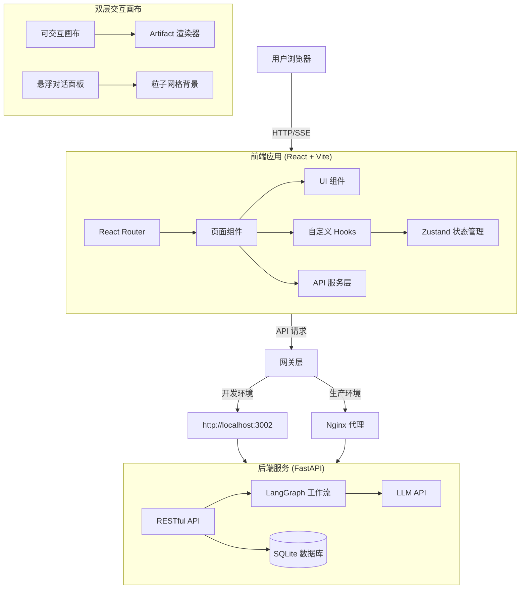

# XPouch AI

基于 LangGraph 的高颜值多智能体 AI 助手，支持**双层交互画布**与**实时内容渲染**。

## 🚀 功能特性

### 🎨 双层交互画布 (核心亮点)

**底层 - 可交互画布 (Interactive Canvas)**
- 全屏覆盖 (`h-screen w-screen`)，固定定位不遮挡
- 径向渐变 + 网格背景，支持深色模式
- **缩放功能**：滚轮缩放 (25%-300%)，底部控制栏
- **平移功能**：拖拽移动，鼠标手势流畅
- **Artifact 渲染**：根据类型动态展示代码预览、流程图、Markdown 文档

**顶层 - 悬浮对话面板 (Floating Chat Overlay)**
- 毛玻璃效果 (`bg-white/90 backdrop-blur-xl`)
- 圆角设计 (`rounded-2xl`)，高深度阴影 (`shadow-2xl`)
- **可收起/展开**：右上角收起按钮 + 右下角机器人恢复按钮
- **平滑动画**：300ms ease-in-out 过渡，紫色渐变机器人图标
- **呼吸效果**：机器人恢复按钮带 `animate-bounce` 提示交互
- **点击穿透**：收起后 `pointer-events-none` 确保画布可点击

### 🤖 AI 智能体
- **8 个专业化 AI 智能体**：内置不同场景的专家助手
- **自定义智能体创建**：用户可构建个性化 AI 助手
- **LangGraph 工作流**：Python 版智能体引擎

### 💬 对话体验
- **实时打字效果**：自然的消息生成与打字动画
- **SSE 流式响应**：基于 Token 的实时流式传输
- **上下文记忆**：自动保存和恢复多轮对话上下文

### 🧭 开发路线图

### 📌 v0.2.x - 核心功能完善（当前）

- ✅ 双层交互画布系统
- ✅ 基于 LangGraph 的多智能体工作流
- ✅ SQLite 数据持久化
- ✅ 完整的 UI/UX 体系
- ✅ 国际化支持（中/英/日）
- 🚧 用户认证与权限管理
- 🚧 知识库集成（RAG）

### 🎯 v0.3.x - 超智能体探索（计划中）

- 🔮 **多智能体协作**：智能体动态分工与协作机制
- 🔮 **自主决策系统**：基于上下文的任务拆解与执行规划
- 🔮 **知识增强引擎**：向量检索 + 实时学习
- 🔮 **推理与反思**：思维链（CoT）+ 自我纠错
- 🔮 **工具调用框架**：可插拔工具生态（搜索、计算、代码执行）

### 🌟 v1.0 - 产品化（未来）

- 🔮 **插件市场**：社区驱动的智能体和工具生态
- 🔮 **企业级功能**：团队协作、审计日志、API 管理
- 🔮 **多模态支持**：图像、语音、视频输入
- 🔮 **云端部署**：SaaS 服务 + 私有化部署支持

### 🎯 界面特性
- **响应式设计**：完美适配移动端、平板和桌面设备
- **移动端手势**：左侧边缘右滑返回（30px 触发区域）
- **深色模式支持**：根据系统偏好自动切换主题，平滑过渡动画
- **国际化**：支持英语、中文和日语
- **路由管理**：React Router 深度集成，支持 URL 分享会话
- **Glassmorphism 设计**：毛玻璃效果 + 深度阴影 + 流畅动画

### 💾 数据持久化
- **SQLite 云端同步**：聊天记录持久化存储
- **历史记录管理**：按时间排序，支持查看和删除

### ⚡ 性能优化
- **Zustand 全局状态管理**：组件逻辑与视图分离
- **智能缓存与按需加载**
- **按需渲染**：交互区域动态加载

## 🛠️ 技术栈

### 前端
| 技术 | 版本 | 用途 |
|------|------|------|
| React | 18.3.1 | UI 框架 |
| TypeScript | 5.6 | 类型系统 |
| React Router | 7.12.0 | 路由管理 |
| Zustand | 5.0.10 | 全局状态管理 |
| Vite | 5.4.17 | 构建工具 |
| Tailwind CSS | 3.4.17 | 原子化样式 |
| shadcn/ui + Radix UI | Latest | 无头组件库 |
| Framer Motion | 11.15.0 | 动画与交互 |
| Lucide React | 0.462.0 | 图标库 |
| Mermaid | 11.12.2 | 流程图渲染 |
| DOMPurify | 3.3.1 | HTML 安全净化 |
| Vitest | 4.0.17 | 单元测试 |

### 后端
| 技术 | 版本 | 用途 |
|------|------|------|
| Python | 3.13+ | 后端语言 |
| FastAPI | 0.128.0+ | 异步 Web 框架 |
| Uvicorn | 0.40.0+ | ASGI 服务器 |
| LangGraph | 1.0.6+ | AI 工作流编排 |
| LangChain OpenAI | 1.1.7+ | LLM 集成 |
| SQLModel | 0.0.31+ | ORM 框架 |
| SQLite | 3.x | 数据库 |
| uv | Latest | Python 包管理器 |

## 🏗️ 系统架构



## 📦 项目结构

**Monorepo 架构** - 前后端分离：

```
xpouch-ai/
├── frontend/                      # 🌐 React 前端应用
│   ├── src/
│   │   ├── components/            # React 组件
│   │   │   ├── ChatPage.tsx           # 聊天页面
│   │   │   ├── CanvasChatPage.tsx     # 画布聊天页
│   │   │   ├── InteractiveCanvas.tsx  # 可交互画布
│   │   │   ├── FloatingChatPanel.tsx  # 悬浮对话面板
│   │   │   ├── ArtifactRenderer.tsx   # 内容渲染器
│   │   │   ├── TaskCanvas.tsx         # 任务画布
│   │   │   ├── Sidebar.tsx            # 侧边栏主组件
│   │   │   ├── SidebarMenu.tsx        # 侧边栏菜单
│   │   │   ├── SidebarUserSection.tsx # 用户区域
│   │   │   ├── SidebarSettingsMenu.tsx# 设置菜单
│   │   │   ├── GlowingInput.tsx       # 发光输入框
│   │   │   ├── AgentCard.tsx          # 智能体卡片
│   │   │   ├── CreateAgentPage.tsx    # 创建智能体页
│   │   │   ├── HomePage.tsx           # 首页
│   │   │   ├── HistoryPage.tsx        # 历史记录页
│   │   │   ├── KnowledgeBasePage.tsx  # 知识库页
│   │   │   ├── ErrorBoundary.tsx      # 错误边界
│   │   │   └── ui/                    # shadcn/ui 基础组件
│   │   ├── store/                 # Zustand 状态管理
│   │   │   ├── chatStore.ts           # 对话历史
│   │   │   ├── canvasStore.ts         # 画布状态
│   │   │   ├── userStore.ts           # 用户信息
│   │   │   └── loadingStore.ts        # 全局加载状态
│   │   ├── hooks/                 # 自定义 Hooks
│   │   │   ├── useChat.ts              # 聊天逻辑
│   │   │   ├── useSwipeBack.ts         # 滑动返回
│   │   │   └── useArtifactListener.ts  # SSE 监听
│   │   ├── services/              # API 服务层
│   │   │   └── api.ts                  # API 客户端
│   │   ├── config/                # 配置文件
│   │   │   └── models.ts              # 模型配置
│   │   ├── constants/             # 常量定义
│   │   │   └── ui.ts                  # UI 常量
│   │   ├── types/                 # TypeScript 类型
│   │   │   └── index.ts               # 全局类型定义
│   │   ├── utils/                 # 工具函数
│   │   │   ├── logger.ts              # 日志工具
│   │   │   └── userSettings.ts        # 用户设置
│   │   ├── i18n/                  # 国际化
│   │   ├── data/                  # 静态数据
│   │   ├── lib/                   # 第三方库封装
│   │   ├── main.tsx               # 应用入口
│   │   └── vite.config.ts         # Vite 配置
│   ├── nginx.conf                 # Nginx 配置 (Docker)
│   ├── package.json               # NPM 依赖
│   └── tsconfig.json              # TypeScript 配置
│
├── backend/                       # 🔧 Python 后端
│   ├── agents/                    # LangGraph 智能体
│   │   └── graph.py               # 工作流定义
│   ├── main.py                    # FastAPI 应用入口
│   ├── models.py                  # SQLModel 数据模型
│   ├── database.py                # 数据库连接
│   ├── pyproject.toml             # Python 项目配置
│   ├── requirements.txt            # Python 依赖列表
│   ├── uv.lock                    # uv 锁定文件
│   ├── .env                       # 环境变量 (需手动创建)
│   ├── Dockerfile                 # Docker 镜像配置
│   └── data/                      # SQLite 数据库目录
│
├── docker-compose.yml             # 🐳 Docker 编排配置
├── CHANGELOG.md                   # 📝 更新日志
└── README.md                      # 📚 项目文档
```

## 🚀 快速开始

### 方式一：Docker 部署（推荐）

**1. 克隆项目**

```bash
git clone https://github.com/your-username/xpouch-ai.git
cd xpouch-ai
```

**2. 配置环境变量**

在 `backend` 目录下创建 `.env` 文件：

```bash
# API 配置
PORT=3002

# 模型提供商 API Keys（至少选择一个）
OPENAI_API_KEY=sk-your-key-here
OPENAI_BASE_URL=https://api.openai.com/v1

# 可选：DeepSeek（更便宜的替代方案）
DEEPSEEK_API_KEY=sk-your-deepseek-key
DEEPSEEK_BASE_URL=https://api.deepseek.com/v1
```

**3. 启动服务**

```bash
docker-compose up --build -d
```

**4. 访问应用**

- 前端：http://localhost:8080
- 后端 API：http://localhost:8080/api

**5. 停止服务**

```bash
docker-compose down
```

### 方式二：本地开发

**前置要求**

- Node.js >= 18.0.0
- Python >= 3.10 (推荐 3.13)
- `uv` (推荐的 Python 包管理器)

**1. 安装前端依赖**

```bash
cd frontend
pnpm install
```

**2. 安装后端依赖**

```bash
cd backend
uv sync
```

**3. 配置环境变量**

后端配置（创建 `backend/.env`）：

```env
PORT=3002
OPENAI_API_KEY=your-api-key
OPENAI_BASE_URL=https://api.openai.com/v1
```

前端配置（创建 `frontend/.env`）：

```env
VITE_API_URL=http://localhost:3002/api
```

**4. 启动后端**

```bash
cd backend
uv run main.py
```

**5. 启动前端**

```bash
cd frontend
pnpm run dev
```

**6. 访问应用**

- 前端：http://localhost:5173
- 后端 API：http://localhost:3002

## 📦 项目结构

本项目采用 **Monorepo** 架构，前端和后端完全分离。

详见上方的详细项目结构说明。

## 🔧 配置说明

### 后端配置（`backend/.env`）

| 变量 | 说明 | 必需 | 默认值 |
|------|------|------|--------|
| `PORT` | 后端服务端口 | 否 | `3002` |
| `OPENAI_API_KEY` | OpenAI API 密钥 | 是* | - |
| `OPENAI_BASE_URL` | OpenAI API 基础 URL | 否 | `https://api.openai.com/v1` |
| `DEEPSEEK_API_KEY` | DeepSeek API 密钥 | 是* | - |
| `DEEPSEEK_BASE_URL` | DeepSeek API 基础 URL | 否 | `https://api.deepseek.com/v1` |

> \* 至少需要配置一个 LLM 提供商的 API 密钥

### 前端配置（`frontend/.env`）

| 变量 | 说明 | 必需 | 默认值 |
|------|------|------|--------|
| `VITE_API_URL` | 后端 API 地址 | 否 | `/api` |

> **开发环境**：使用 `http://localhost:3002/api`
> **生产环境**：使用 `/api`（由 Nginx 代理）

## 🚀 部署说明

### Docker 部署（推荐）

**优势**：
- ✅ 一键启动，无需手动配置环境
- ✅ 完整的 Nginx 反向代理
- ✅ 生产环境就绪
- ✅ 数据持久化（挂载卷）

**更新部署**：

```bash
git pull
docker-compose up --build -d
```

### 生产部署建议

1. **使用环境变量管理工具**（如 dotenv-vault）
2. **配置 HTTPS**（使用 Let's Encrypt + Nginx）
3. **配置数据库备份**（SQLite 定期备份）
4. **配置日志收集**（Sentry 集成）
5. **配置 CDN**（静态资源加速）

## 📖 使用指南

### 双层交互画布

1. **缩放**：使用鼠标滚轮或底部控制栏（25%-300%）
2. **平移**：按住画布空白区域拖动
3. **收起/展开**：点击右上角收起图标或右下角机器人按钮
4. **移动端返回**：从屏幕左侧边缘右滑返回首页（滑动 >100px 触发）

### Artifact 渲染

- **代码**：自动识别并渲染代码预览，支持复制
- **Mermaid**：动态渲染流程图、时序图等
- **Markdown**：安全渲染 Markdown 文档

### 创建自定义智能体

1. 点击首页的"创建智能体"按钮
2. 填写智能体名称、描述、分类
3. 编写系统提示词（定义 AI 的行为和性格）
4. 实时预览卡片效果
5. 点击"创建"完成

### 多模型支持

项目支持多个 LLM 提供商：

- **OpenAI**：GPT-4o, GPT-4o-mini, GPT-3.5-turbo
- **DeepSeek**：deepseek-chat, deepseek-coder
- **Anthropic**：Claude 3.5 Sonnet（需配置）
- **Google**：Gemini Pro（需配置）

在 `backend/.env` 中配置相应的 API 密钥即可。

## 🤝 贡献指南

我们欢迎所有形式的贡献！

### 开发规范

- **代码风格**：遵循 ESLint 和 Prettier 配置
- **提交信息**：使用 Conventional Commits 规范
- **测试**：为新增功能编写单元测试
- **文档**：更新相关文档和 CHANGELOG

### 提交 Pull Request

1. Fork 本仓库
2. 创建特性分支：`git checkout -b feature/amazing-feature`
3. 提交更改：`git commit -m 'feat: add amazing feature'`
4. 推送到分支：`git push origin feature/amazing-feature`
5. 打开 Pull Request 并描述更改内容

### 报告问题

- [Bug 反馈](https://github.com/your-username/xpouch-ai/issues/new?template=bug_report.md)
- [功能建议](https://github.com/your-username/xpouch-ai/issues/new?template=feature_request.md)

## 📚 技术文档

- [CHANGELOG.md](./CHANGELOG.md) - 详细的更新日志
- [API 文档](http://localhost:3002/docs) - FastAPI Swagger 文档（启动后端后访问）
- [前端组件文档](./frontend/README.md) - 组件使用说明（待完善）

## 📄 许可证

本项目基于 [MIT License](./LICENSE) 开源。

## 🙏 致谢

感谢以下开源项目：

- [LangGraph](https://github.com/langchain-ai/langgraph) - AI 工作流框架
- [shadcn/ui](https://ui.shadcn.com/) - 美观的 UI 组件库
- [Framer Motion](https://www.framer.com/motion/) - React 动画库
- [Tailwind CSS](https://tailwindcss.com/) - 原子化 CSS 框架
- [Radix UI](https://www.radix-ui.com/) - 无头 UI 组件

## 📮 联系方式

- **作者**：Your Name
- **邮箱**：your-email@example.com
- **主页**：https://yourwebsite.com

## 🌟 Star History

如果这个项目对你有帮助，请给我们一个 Star！

<a href="https://star-history.com/#your-username/xpouch-ai&Date">
  <picture>
    <source media="(prefers-color-scheme: dark)" srcset="https://api.star-history.com/svg?repos=your-username/xpouch-ai&type=Date&theme=dark" />
    <source media="(prefers-color-scheme: light)" srcset="https://api.star-history.com/svg?repos=your-username/xpouch-ai&type=Date&theme=light" />
    
  </picture>
</a>
